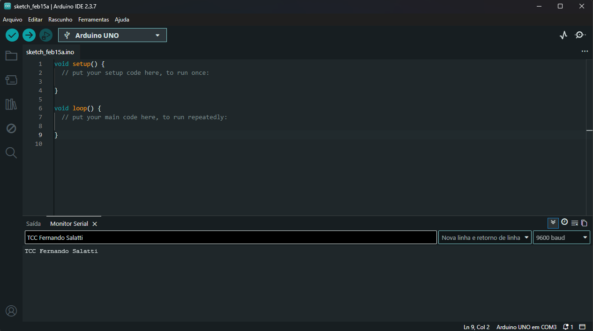
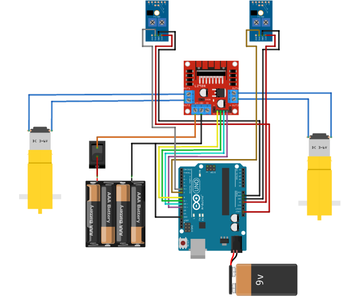
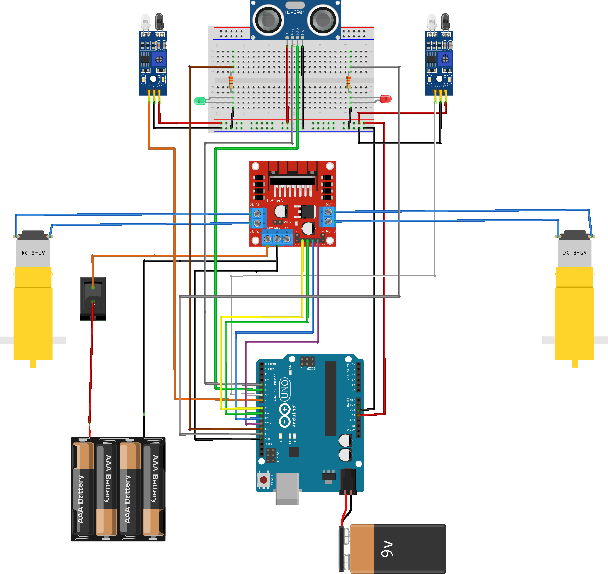

# 🤖 Projeto: Robô Seguidor de Linha com Arduino

Seja muito bem-vindo(a)!

Este é o material de apoio para o desenvolvimento do seu **primeiro projeto em eletrônica**.  
A proposta é que você consiga montar e programar seu robô **apenas seguindo este README e utilizando os arquivos do repositório**, mesmo que ainda não tenha muita experiência.

Vamos utilizar como base o material didático fornecido junto com o **Kit Arduino Robótica**, porém faremos algumas melhorias para deixar o projeto mais completo e robusto.

> 💡 Dica: Utilize o material do kit para entender melhor cada componente.  
> Neste guia, o foco será **montagem e programação do projeto**.

---

# 📌 Sobre o Projeto

O projeto consiste na construção de um **robô seguidor de linha**.

Robôs seguidores de linha são dispositivos que se movimentam seguindo um trajeto previamente definido no chão (geralmente uma linha preta sobre fundo branco).

### Como ele funciona:

1. Sensores detectam a diferença de cor no solo.
2. As informações são enviadas para o Arduino.
3. O código interpreta esses dados.
4. O robô decide para onde deve ir (esquerda, direita ou frente).

Neste projeto, além da função de seguir linha, vamos adicionar um **sensor de distância ultrassônico**, permitindo que o robô:

- Detecte obstáculos
- Pare antes de bater
- Fique mais inteligente e seguro

Também adicionaremos **LEDs de indicação de status**, que mostram visualmente o estado do robô durante o funcionamento.

---

# 🧰 Componentes Utilizados

Todos os componentes abaixo estão presentes no kit:

- Placa Arduino Uno R3  
- Cabo USB 2.0 (30cm)  
- Adaptador para bateria 9V  
- Bateria 9V  
- Suporte para 4 pilhas AA  
- 4 pilhas AA  
- Protoboard  
- Jumpers macho-macho  
- Jumpers macho-fêmea  
- 2x Motor DC 3–6V  
- Sensor de Distância Ultrassônico HC-SR04  
- Kit Chassi 2 rodas  
- 2x Módulo Seguidor de Linha TCRT5000  
- Ponte H Dupla L298N  
- 1x LED Verde  
- 1x LED Vermelho  
- 2x Resistores de **330Ω**

---

# 🔄 Teste de Comunicação (Loopback)

Antes de montar o robô, é importante verificar se a comunicação entre o seu computador e a placa Arduino está funcionando corretamente.

### Passo a passo do teste:

1. Conecte o Arduino ao computador via cabo USB.

2. Para que o teste de loopback funcione, conecte também **os pinos TX e RX do Arduino entre si** (TX no pino RX e RX no pino TX), além de garantir que o Arduino esteja alimentado corretamente (5V e GND).

3. Abra a Arduino IDE e, em seguida, o **Monitor Serial** (ícone de lupa no canto superior direito da IDE ou no menu `Ferramentas > Monitor Serial`).

4. No campo de texto do Monitor Serial (parte superior), digite uma mensagem qualquer e envie.

5. Se a comunicação estiver funcionando, você deverá ver a mesma mensagem aparecer logo abaixo no Monitor Serial, indicando que o Arduino está recebendo e enviando dados corretamente.

---

# 🔧 Montagem do Projeto

## 📷 Montagem Original

A montagem sugerida no material do kit utiliza praticamente todos os componentes listados acima.

---

## 🚀 Nossa Modificação

No projeto original não há o sensor ultrassônico.

Nós iremos adicionar o **HC-SR04**, responsável por detectar obstáculos e impedir que o robô colida com objetos.

### ⚠️ Problema encontrado

Ao tentar adicionar o sensor diretamente no Arduino, percebemos que:

- Não há pinos GND suficientes
- Não há pinos 5V suficientes

Ou seja, não conseguimos simplesmente conectar mais um componente diretamente na placa.

---

## 🧠 Solução: Uso da Protoboard

Para resolver isso, vamos utilizar a **protoboard como distribuidora de energia**.

### Como funcionará:

1. Conecte:
   - 1 fio do GND do Arduino → trilha negativa da protoboard
   - 1 fio do 5V do Arduino → trilha positiva da protoboard

2. A partir da protoboard:
   - Alimente todos os sensores
   - Alimente o módulo L298N (se necessário)
   - Alimente o sensor ultrassônico

Dessa forma:

- Organizamos melhor os fios
- Evitamos sobrecarga nos pinos
- Deixamos o projeto mais organizado e profissional

---

# 💡 Indicadores Visuais com LEDs

Para tornar o comportamento do robô mais fácil de entender durante os testes, adicionamos **dois LEDs indicadores de status**.

Esses LEDs mostram visualmente se o robô está funcionando normalmente ou se detectou um obstáculo.

---

## 🟢 LED Verde — Funcionamento Normal

Quando o robô **não detecta obstáculos**, ele:

- Continua seguindo a linha normalmente
- Mantém o **LED verde aceso**

Isso indica que o robô está operando normalmente.

---

## 🔴 LED Vermelho — Obstáculo Detectado

Quando o **sensor ultrassônico detecta um objeto a menos de 15 cm**, o robô:

- Para imediatamente
- Acende o **LED vermelho**

Isso indica que o robô interrompeu o movimento para **evitar colisão**.

---

# 🔌 Ligação dos LEDs

Cada LED deve ser ligado com um **resistor de 330Ω** para limitar a corrente e evitar danos ao componente.

### LED Verde

Conexão:

- **Pino 12 do Arduino → Resistor 330Ω → Perna longa do LED**
- **Perna curta do LED → GND**

---

### LED Vermelho

Conexão:

- **Pino 13 do Arduino → Resistor 330Ω → Perna longa do LED**
- **Perna curta do LED → GND**

---

### Resumo das conexões

| LED | Pino Arduino | Função |
|----|----|----|
| 🟢 Verde | 12 | Robô em funcionamento |
| 🔴 Vermelho | 13 | Obstáculo detectado |

---

# 📁 Estrutura do Repositório

Este repositório contém:

- Código-fonte do Arduino
- Imagens dos esquemas de ligação
- Este guia passo a passo

---

# 🪜 Passo a Passo

Siga esta ordem:

1. Monte o chassi
2. Instale os motores
3. Fixe os sensores
4. Faça as conexões elétricas conforme o esquema modificado
5. Conecte o Arduino ao computador via USB
6. Faça o upload do código
7. Teste o funcionamento

---

# ⚡ Como Funciona o Robô

## 🔎 Seguidor de Linha

Os sensores TCRT5000 detectam a linha no chão.
Aprenda sobre o sensor aqui: https://www.youtube.com/watch?v=dAQYf4zdnks
- Linha detectada → envia sinal ao Arduino  
- Fora da linha → Arduino corrige a direção  

---

## 📡 Sensor Ultrassônico

O HC-SR04 mede a distância até um objeto à frente.
Aprenda sobre o sensor aqui: https://www.youtube.com/watch?v=TX62dkfrb34
Se a distância for menor que o valor definido no código:

- O robô para
- O **LED vermelho acende**
- Evita colisão

Quando não há obstáculos:

- O robô continua seguindo a linha
- O **LED verde permanece aceso**

---

# 🎯 Objetivo Final

Ao final deste projeto, você terá:

- ✔ Um robô seguidor de linha funcional  
- ✔ Sistema de parada por obstáculo  
- ✔ Indicadores visuais de status (LEDs)  
- ✔ Conhecimento básico de:
  - Sensores
  - Controle de motores
  - Programação em Arduino
  - Distribuição de energia com protoboard  

---

# 💡 Dicas Importantes

- Sempre revise as conexões antes de ligar a bateria.
- Teste primeiro alimentando pelo USB.
- Se algo não funcionar, revise:
  - Ligações GND
  - Ligações 5V
  - Pinos definidos no código

---

# 🚀 Próximo Passo

Agora que você já entendeu a estrutura do projeto:

➡️ Monte o robô  
➡️ Configure o ambiente Arduino  
➡️ Faça o upload do código  
➡️ Realize os testes  

Se seguir o passo a passo com atenção, você conseguirá montar tudo mesmo sendo iniciante.

Bom projeto!
